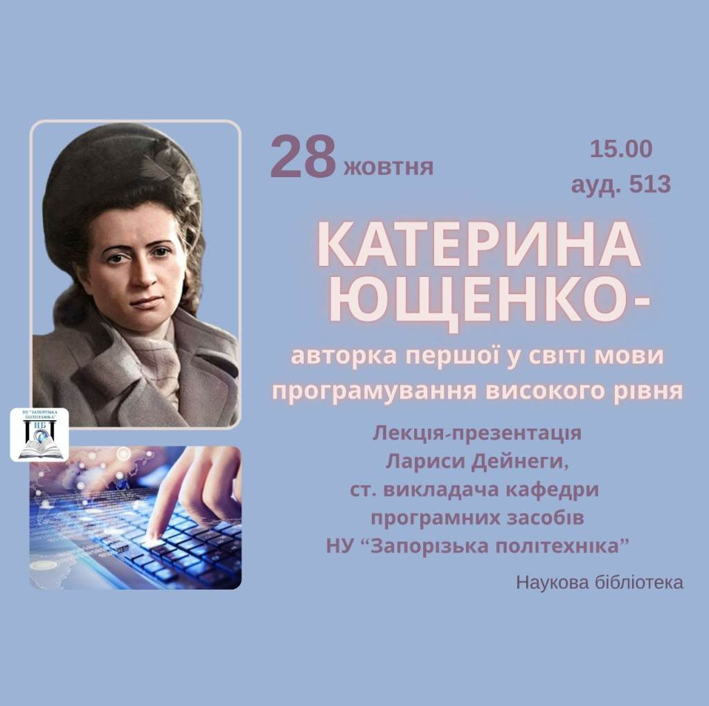
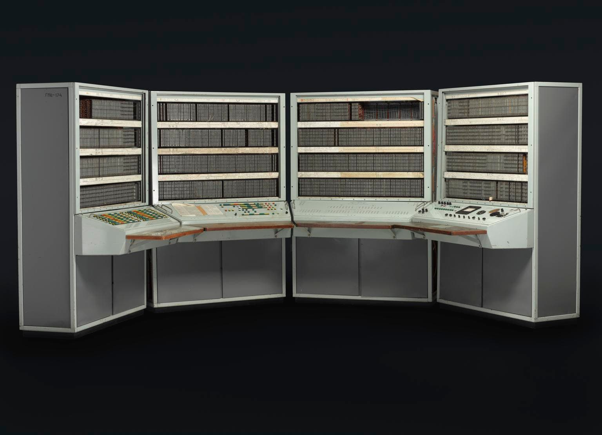
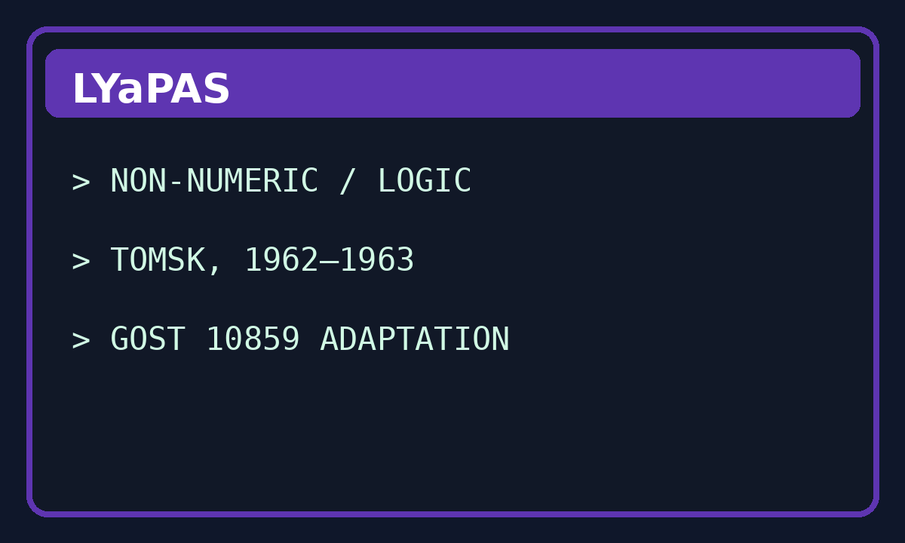
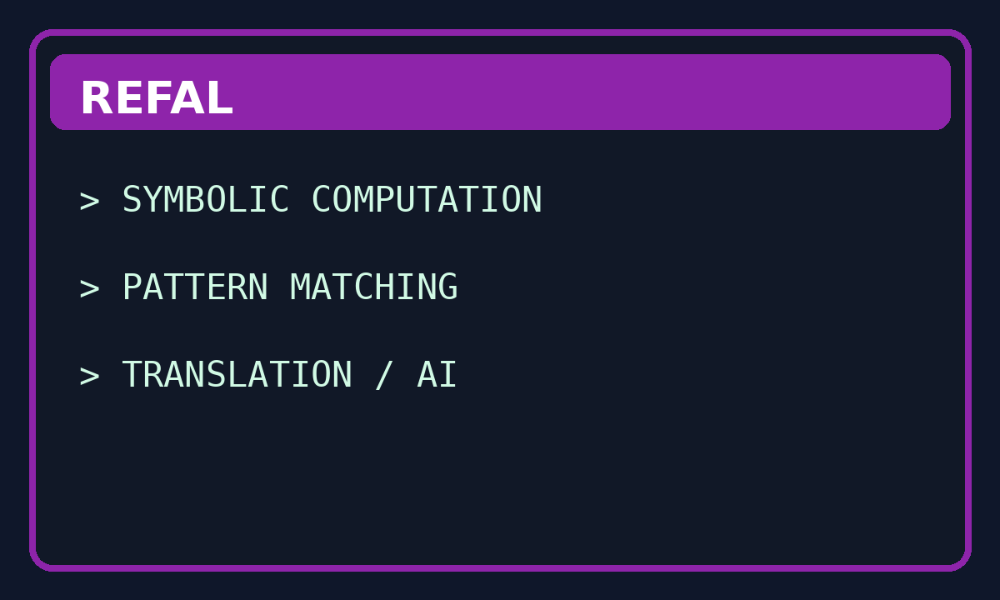
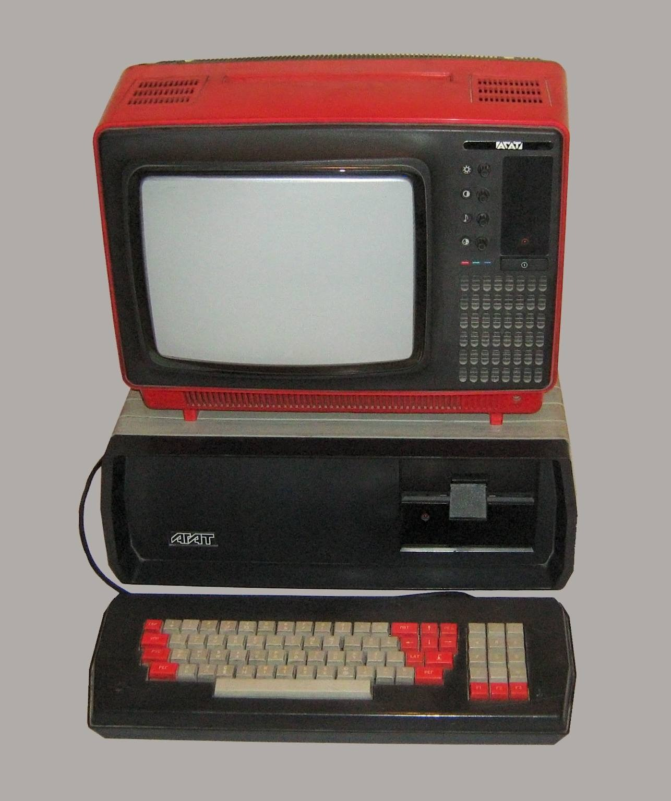
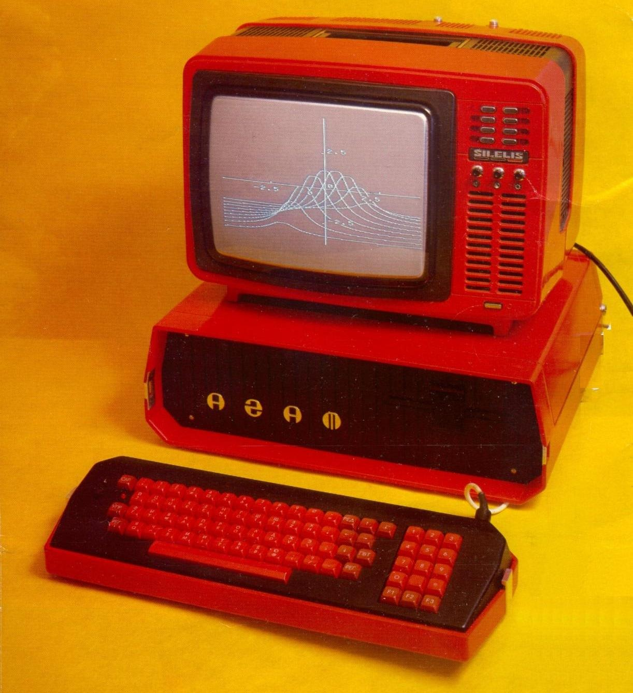
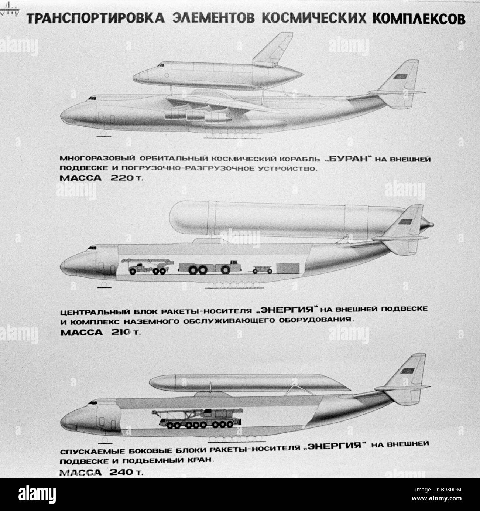
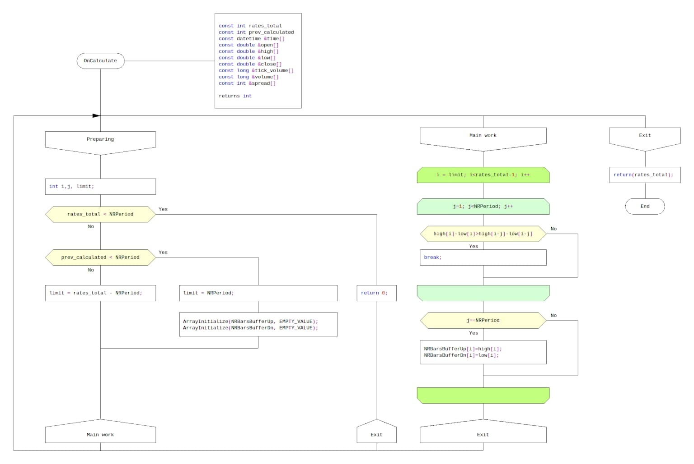

# USSR Programming Languages Timeline

This README recreates the final two-page portrait handout as closely as practical in GitHub Markdown. PDF-only layout features such as exact card positioning, embedded page numbers, and clickable PDF annotations are approximated here with tables, headings, bullet points, and standard Markdown links.

---

## 1955 — Address Programming Language

| Image | Summary |
|---|---|
|  | **Early Soviet high-level language** by Kateryna Yushchenko. Used for economic, military, aviation, and early space calculations. **Key points:** - Created in Kyiv - Advanced address/pointer ideas - Applied to early technical planning Refs [1][2] |

## 1958–63 — ALMO

| Image | Summary |
|---|---|
|  | **Machine-oriented algorithmic system** used in compiler and systems work around major Soviet installations. **Key points:** - Compiler-oriented design - Close to machine structure - Linked to BESM-era systems work Refs [2][3] |

## 1962–63 — LYaPAS

| Image | Summary |
|---|---|
|  | **Tomsk language** for non-numeric and logic-style processing, later adapted to the Soviet GOST 10859 character set. **Key points:** - Developed in Tomsk - Non-numeric processing focus - Adapted to GOST 10859 Ref [4] |

## 1966–68 — Refal

| Image | Summary |
|---|---|
|  | **Symbolic pattern-matching language** used for translation, formula manipulation, and early AI-style work. **Key points:** - Created by Valentin Turchin - Strong symbolic manipulation - Useful for translation and AI Refs [5][6] |

---

## 1978–79 — Rapira

| Image | Summary |
|---|---|
|  | **Russian-syntax educational language** for Agat and Soviet PDP-11-compatible systems. **Key points:** - Russian-style keywords - Popular in education - Ran on Agat and DVK-class machines Ref [7] |

## 1980s — Robik

| Image | Summary |
|---|---|
|  | **Child-focused descendant of Rapira** designed for primary-school teaching. **Key points:** - Made for younger learners - Simplified educational focus - School-oriented rather than industrial Ref [7] |

## 1986 — Buran toolchain

| Image | Summary |
|---|---|
|  | **PROL2, DIPOL, and LAKS** supported onboard, ground, and modelling software during the Buran shuttle effort. **Key points:** - Multiple specialist languages - Aerospace mission software - Set the stage for DRAKON Refs [8][9] |

## 1996 — DRAKON

| Image | Summary |
|---|---|
|  | **Visual language** completed after Buran and later reported in aerospace, oil, and nuclear-power procedures. **Key points:** - Diagram-based notation - Built for clarity and safety - Later used beyond space projects Refs [9][10] |

---

## References

1. [ICFCST, *Kateryna L. Yushchenko — Inventor of Pointers*](https://www.icfcst.kiev.ua/MUSEUM/TXT/KaterynaL-Yushchenko.pdf)
2. [Ershov Institute, *Development of Programming in the USSR*](https://www.iis.nsk.su/en/preprints/articles/dev_of_prog)
3. [ALMO historical material](https://blog.arbinada.com/ru/files/prep2013_29_p20_almo.pdf)
4. [Tomsk State University, *TSU is reviving one of the first Russian programming languages*](https://en-news.tsu.ru/news/tsu-are-reviving-one-of-the-first-russian-programming-languages/)
5. [Refal-5λ introduction](http://bmstu-iu9.github.io/refal-5-lambda/2-intro.en.html)
6. [Refal.net historical and technical material](http://www.refal.net/english/xmlref_1.htm)
7. [Rapture / Rapira archival notes](https://github.com/mattmikolay/rapture)
8. [MIT-hosted *Computers for Spacecraft* essay](https://web.mit.edu/slava/space/essays/essay-dubova.htm)
9. [Buran-Energia onboard computer page](https://www.buran-energia.com/bourane-buran/bourane-consti-ordinateur-computer.php)
10. [Parondzhanov author page](https://habr.com/ru/users/parondzhanov/)

---

## Repository notes

For a GitHub README, this ZIP is already structured for GitHub. Upload the contents of the ZIP as a repository root, with the README in the top level and the images inside `images/`. Included assets:

- `yushchenko.jpg`
- `besm6_v2.jpg`
- `panel_2.png`
- `panel_3.png`
- `img_4.jpg`
- `img_5.jpg`
- `img_6.jpg`
- `img_7.jpg`
